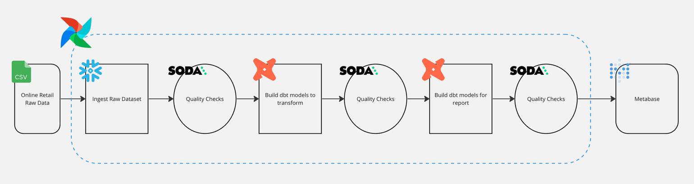
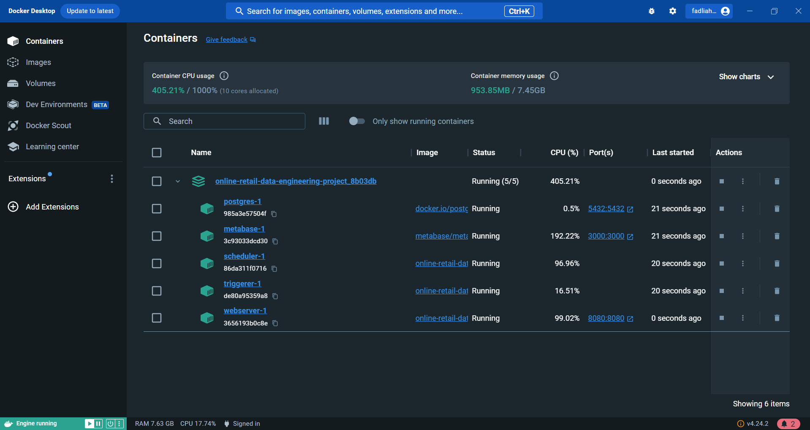

# Online Retail - Analytics Engineering Project

## Introduction 
This project aims to perform end-to-end data engineer analytics on the Online Retail dataset using various tools and technologies, including Google Cloud Storage, Python, Docker, Astronomer, Apache Airflow, BigQuery, Soda, dbt, and Metabase. 

Executive summary: 

🔧 What I do:

    📥 Importing and loading the dataset from local storage into Google Cloud Storage
    🐳 Creating a container in Docker to run the Airflow
    🔄 Transforming data using dbt 
    🪁 Creating a data pipeline using Airflow
    🍹 Checking the data quality using Soda.io 
    🏭 Managing data warehouse in BigQuery (dimensional, fact, and mart table concept) 
    📊 Creating a dashboard and analyzing the data using Metabase 
      
📒 Notes: 

## Architecture 
🏛️ The architecture I used in this project: 
 

## Tools 
🔧 Tools I used in this project:

    🖥️ Google Cloud Platform
        - Google Cloud Storage  
        - Google BigQuery 
    🐳 Docker
    🐍 Python 
    🔮 Astronomer CLI 
    🪁 Apache Airflow 
    🍹 Soda.io
    ☄️ Cosmos 
    🔄 dbt
    🗃️ SQL
    📊 Metabase

## Dataset 
Here is the dataset used in this project - https://www.kaggle.com/datasets/tunguz/online-retail?resource=download 

## Data Model 
📑 Data modeling in this project: 
 

## Creating Google Cloud Storage Bucket 
📥 It's an online file storage provided as a service by GCP. It helps us store, and retrieve files from anywhere in the cloud with an internet connection.
 

## Container in Docker 
🐳 Docker is a tool you can use to define and share multi-container applications. In this project I used docker to run Airflow and Metabase locally. 
 

## Creating a data pipeline using Airflow
🪁 Airflow is the open-source tool to set up your ETL pipeline. 

## Data Transformation using dbt and Data Quality Checking using Soda.io 
    🔄 dbt is an open-source command line tool that helps analysts and engineers transform data in their warehouse more effectively; 
    🍹 Soda.io is a tool for data quality tests in the data stack and workflows. 
 

## Managing data warehouse in BigQuery 
🏭 It's a warehouse provided by Google that helps us store, and analyze large-scale data sets using a SQL-type interface and query language. 
 

## Dashboard 
🔍 Metabse Dashboard result: 
  

I'm really sorry for that pie chart :D

## Full tutorial

Big thanks to Marc Lamberti. I appreciate your tutorial and explanation of this project. This project is quite complex, but you explain it in very easy way to understand.

You can find the full tutorial for this project at: https://www.youtube.com/watch?v=DzxtCxi4YaA&t=481s&ab_channel=DatawithMarc 

You can find his LinkedIn profile here: https://www.linkedin.com/in/marclamberti/ 
